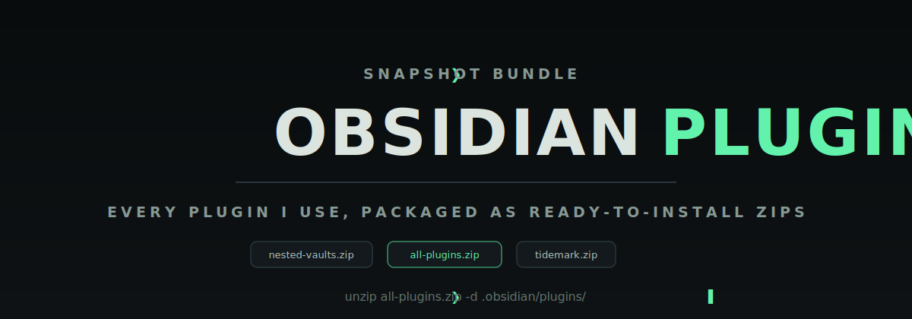

  

# Obsidian Plugin Collection

A snapshot of the Obsidian plugins I use, bundled as ready-to-install zip files in the [Releases](https://github.com/Real-Fruit-Snacks/obsidian-plugins/releases) section.

A browsable index of every plugin, with links to its Obsidian community listing and its source repository, is available on the [plugin index page](https://real-fruit-snacks.github.io/obsidian-plugins/).

## What is included

Each zip in a release contains a single plugin folder with only the files Obsidian needs to run it:

- `main.js`
- `manifest.json`
- `styles.css` (when the plugin ships one)

Personal configuration (`data.json`), backups, and development artifacts are deliberately excluded. The `all-plugins.zip` asset bundles every plugin folder in one archive.

## Installation

1. Download a plugin zip (or `all-plugins.zip`) from the latest release.
2. Extract it into your vault's `.obsidian/plugins/` directory so each plugin sits in its own folder.
3. Reload Obsidian, then enable the plugin under Settings > Community plugins.

## Plugins

### Community plugins

| Plugin | Version | Description | Links |
| --- | --- | --- | --- |
| Advanced Canvas | 6.4.0 | Supercharge your canvas experience! Create presentations, flowcharts and more! | [Community](https://community.obsidian.md/search?type=plugin&q=Advanced%20Canvas) / [GitHub](https://github.com/developer-mike/obsidian-advanced-canvas) |
| Advanced Tables | 0.23.2 | Improved table navigation, formatting, manipulation, and formulas. | [Community](https://community.obsidian.md/search?type=plugin&q=Advanced%20Tables) / [GitHub](https://github.com/tgrosinger/advanced-tables-obsidian) |
| Attachment Management | 0.12.1 | Customize your attachment path of notes independently with variables and auto rename it on change. | [Community](https://community.obsidian.md/search?type=plugin&q=Attachment%20Management) / [GitHub](https://github.com/trganda/obsidian-attachment-management) |
| belki | 0.4.1 | A minimal Todoist-like task manager using local Markdown files. | [Community](https://community.obsidian.md/search?type=plugin&q=belki) / [GitHub](https://github.com/aribuga/obsidian-belki-tasks) |
| Commander | 0.5.5 | Customize your workspace by adding commands everywhere, create Macros and supercharge your mobile toolbar. | [Community](https://community.obsidian.md/search?type=plugin&q=Commander) / [GitHub](https://github.com/jsmorabito/obsidian-commander) |
| Cove | 1.0.6 | Bookmark manager with four switchable layouts. Each bookmark is a Markdown file with YAML frontmatter. | [Community](https://community.obsidian.md/search?type=plugin&q=Cove) / [GitHub](https://github.com/Real-Fruit-Snacks/Cove) |
| Dataview | 0.5.68 | Complex data views for the data-obsessed. | [Community](https://community.obsidian.md/search?type=plugin&q=Dataview) / [GitHub](https://github.com/blacksmithgu/obsidian-dataview) |
| Excalidraw | 2.25.2 | Sketch Your Mind. Edit and view Excalidraw drawings. Enter the world of 4D Visual PKM. | [Community](https://community.obsidian.md/search?type=plugin&q=Excalidraw) / [GitHub](https://github.com/zsviczian/obsidian-excalidraw-plugin) |
| File Hider | 1.1.1 | Allows hiding files and folders in the built-in file explorer. | [Community](https://community.obsidian.md/search?type=plugin&q=File%20Hider) / [GitHub](https://github.com/eldritch-oliver/file-hider) |
| Git | 2.38.6 | Integrate Git version control with automatic backup and other advanced features. | [Community](https://community.obsidian.md/search?type=plugin&q=Git) / [GitHub](https://github.com/Vinzent03/obsidian-git) |
| GitHub Updater | 1.2.2 | Download and install unofficial plugins directly from GitHub. | [Community](https://community.obsidian.md/search?type=plugin&q=GitHub%20Updater) / [GitHub](https://github.com/Real-Fruit-Snacks/obsidian-github-updater) |
| Gym Tracker | 1.0.2 | Track gym workouts, exercise volume, streaks, and history on mobile and desktop. | [Community](https://community.obsidian.md/search?type=plugin&q=Gym%20Tracker) / [GitHub](https://github.com/Real-Fruit-Snacks/obsidian-gym-tracker) |
| Homepage | 4.4.4 | Open a specified note, canvas, base, or workspace on startup, or set it for quick access later. | [Community](https://community.obsidian.md/search?type=plugin&q=Homepage) / [GitHub](https://github.com/mirnovov/obsidian-homepage) |
| Iconic | 1.1.9 | Customize your icons and their colors directly from the UI, including tabs, files and folders, bookmarks, tags, properties, and ribbon commands. | [Community](https://community.obsidian.md/search?type=plugin&q=Iconic) / [GitHub](https://github.com/gfxholo/iconic) |
| Nested Vaults | 1.1.0 | Scope your vault to a specific folder, effectively treating it as a nested sub-vault. | [Community](https://community.obsidian.md/search?type=plugin&q=Nested%20Vaults) / [GitHub](https://github.com/Real-Fruit-Snacks/obsidian-nested-vaults) |
| Paste URL into selection | 1.11.4 | Paste URL "into" selected text to create markdown links. | [Community](https://community.obsidian.md/search?type=plugin&q=Paste%20URL%20into%20selection) / [GitHub](https://github.com/denolehov/obsidian-url-into-selection) |
| Pixel Pets | 1.6.0 | Adds cute and interactive pixel pets. | [Community](https://community.obsidian.md/search?type=plugin&q=Pixel%20Pets) / [GitHub](https://github.com/lucashjin/obsidian-pets) |
| Pocket Bird | 2026.5.15 | Add a pet bird to fly around your notes and keep you company! | [Community](https://community.obsidian.md/search?type=plugin&q=Pocket%20Bird) / [GitHub](https://github.com/idreesinc/PB-Obsidian-Releases) |
| Recent Files | 1.7.9 | List files by most recently opened. | [Community](https://community.obsidian.md/search?type=plugin&q=Recent%20Files) / [GitHub](https://github.com/tgrosinger/recent-files-obsidian) |
| Settings Search | 1.3.10 | Globally search settings in Obsidian. | [Community](https://community.obsidian.md/search?type=plugin&q=Settings%20Search) / [GitHub](https://github.com/javalent/settings-search) |
| Style Settings | 1.0.9 | Offers controls for adjusting theme, plugin, and snippet CSS variables. | [Community](https://community.obsidian.md/search?type=plugin&q=Style%20Settings) / [GitHub](https://github.com/obsidian-community/obsidian-style-settings) |
| Tag Wrangler | 0.6.4 | Rename, merge, toggle, and search tags from the tags view. | [Community](https://community.obsidian.md/search?type=plugin&q=Tag%20Wrangler) / [GitHub](https://github.com/pjeby/tag-wrangler) |
| Templater | 2.20.6 | Advanced templating and automation using handlebars-like syntax. | [Community](https://community.obsidian.md/search?type=plugin&q=Templater) / [GitHub](https://github.com/silentvoid13/Templater) |
| Terminal Workbench Pet | 1.1.1 | A small floating ghost that drifts around your vault, follows your cursor, and recolors when you boop it. Matches the Terminal Workbench theme palette. | [Community](https://community.obsidian.md/search?type=plugin&q=Terminal%20Workbench%20Pet) / [GitHub](https://github.com/Real-Fruit-Snacks/terminal-workbench-pet) |
| Tidemark | 1.0.2 | Replace {{variables}} with YAML frontmatter values on demand. | [Community](https://community.obsidian.md/search?type=plugin&q=Tidemark) / [GitHub](https://github.com/Real-Fruit-Snacks/Tidemark) |
| Vim Motions | 0.40.0 | Enhances the built-in Vim mode with Markdown-aware text objects, structural navigation, workspace keyboard control, and a polished Neovim-native experience. | [Community](https://community.obsidian.md/search?type=plugin&q=Vim%20Motions) / [GitHub](https://github.com/saberzero1/motions) |
| Wayback Linker | 1.0.3 | Archive external links in the active note with the Wayback Machine and replace them with snapshot URLs. | [Community](https://community.obsidian.md/search?type=plugin&q=Wayback%20Linker) / [GitHub](https://github.com/Real-Fruit-Snacks/wayback-linker) |

### Unofficial plugins

These are not in the official community plugin directory and are installed directly from GitHub.

| Plugin | Version | Description | Links |
| --- | --- | --- | --- |
| Amazon Order Sync | 1.1.0 | Receives order data from the Amazon Order Sync browser extension and creates markdown notes. | [GitHub](https://github.com/Real-Fruit-Snacks/amazon-order-sync) |
| slate | 0.1.0 | A minimal Todoist-like task manager using local Markdown files. | — |
| Wake | 1.0.1 | A keyboard-first task manager with projects, recurring tasks, priorities, smart views, and a permanent logbook in a self-contained panel. | [GitHub](https://github.com/Real-Fruit-Snacks/Wake) |

## Notes

- All plugins remain the property of their respective authors and are distributed here only as a personal backup and convenience bundle. See each plugin's repository for its license.
- Versions reflect the snapshot date of the release and may lag behind upstream.
